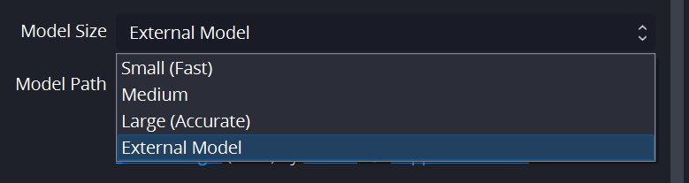

# How to train your custom model for OBS Detect plugin

OBS Detect is based on the [EdgeYOLO](https://github.com/LSH9832/edgeyolo) work.
They provide a model training script that works with just setting some parameters.

You need to get a dataset first. The supported dataset formats are mentiond in the [EdgeYOLO](https://github.com/LSH9832/edgeyolo?tab=readme-ov-file#train) readme: COCO, VOC, YOLO, and DOTA.

In this example we will use a COCO dataset from Roboflow. You can get the dataset from [here](https://public.roboflow.com/object-detection/aquarium/2).

The dataset is in the COCO format, so we can use it directly with the EdgeYOLO training script.

### Enviroment requirements

You will need a GPU to train the model. The training process is quite slow on a CPU.

On Windows you can should the Windows Subsystem for Linux (WSL) to run the training script.

## Step 1: Unpack the dataset

Unzip the dataset to a folder. The dataset should have the following structure:

```plaintext
dataset_folder/
    train/
        _annotations.coco.json
        image1.jpg
        image2.jpg
        ...
    valid/
        _annotations.coco.json
        image1.jpg
        image2.jpg
        ...
    test/
        _annotations.coco.json
        image1.jpg
        image2.jpg
        ...
```

## Step 2: Install the required files

Go to the EdgeYOLO repository and clone it to your machine:

```bash
git clone git@github.com:LSH9832/edgeyolo.git
```

The rest of this guide assumes you have the EdgeYOLO repository cloned to your machine and you are in the root of that repository.

You need to install the required packages to train the model. You can install them using the following command:

```bash
pip install -r requirements.txt
```

**Make sure to download a pretrained model** from the EdgeYOLO repository. You can download e.g. the EdgeYOLO Tiny LRELU model from [here](https://github.com/LSH9832/edgeyolo/releases/download/v0.0.0/edgeyolo_tiny_lrelu_coco.pth). This will speed up your process tremendously.

## Step 3: Setup the parameters of the training script

You need to set the parameters of the training script to train on your data.
Make a copy of the configuration file and set the parameters according to your needs.
For example for my case, I will set the following parameters in the `params/train/train_coco_aquarium.yaml` file:

```yaml
# models & weights------------------------------------------------------------------------------------------------------
model_cfg: "params/model/edgeyolo_tiny_lrelu_aquarium.yaml"         # model structure config file
weights: "**!! Set this to the path of your pretrained .pth model !!**"  # contains model_cfg, set null or a no-exist filename if not use it
use_cfg: false                                       # force using model_cfg instead of cfg in weights to build model

# output----------------------------------------------------------------------------------------------------------------
output_dir: "output/train/edgeyolo_tiny_coco_aquarium"        # all train output file will save in this dir
save_checkpoint_for_each_epoch: true                 # save models for each epoch (epoch_xxx.pth, not only best/last.pth)
log_file: "log.txt"                                  # log file (in output_dir)

# dataset & dataloader--------------------------------------------------------------------------------------------------
dataset_cfg: "params/dataset/coco_aquarium.yaml"              # dataset config
batch_size_per_gpu: 8                                # batch size for each GPU
loader_num_workers: 4                                # number data loader workers for each GPU
num_threads: 1                                       # pytorch threads number for each GPU

# device & data type----------------------------------------------------------------------------------------------------
device: [0]                                 # training device list
fp16: false                                          # train with fp16 precision
cudnn_benchmark: false                               # it's useful when multiscale_range is set zero

# the rest of the file ...
```

Note the gpu device number in the `device` field. You can set it to `[0]` if you have only one GPU.

Note that the `model_cfg` field points to the model configuration file. You can find the model configuration files in the `params/model/` folder. This is required to set the model architecture, but mostly the number of classes. Make a copy of one of the architechtures with a new filename. This is an example of the top of my new `edgeyolo_tiny_lrelu_aquarium.yaml` file:

```yaml
# parameters
nc: 6  # number of classes - match the number of classes in the dataset
depth_multiple: 1.0  # model depth multiple
width_multiple: 1.0  # layer channel multiple

# anchors
# ...
```

You will also need to set up the dataset configuration file `params/dataset/coco_aquarium.yaml`:

```yaml
type: "coco"

dataset_path: "<...>/Downloads/edgeyolo/Aquarium Combined.v2-raw-1024.coco"

kwargs:
  suffix: "jpg"
  use_cache: true      # (test on i5-12490f) Actual time cost:  52s -> 10s(seg enabled) and 39s -> 4s (seg disabled)

train:
  image_dir: "<...>/Downloads/edgeyolo/Aquarium Combined.v2-raw-1024.coco/train"
  label: "<...>/Downloads/edgeyolo/Aquarium Combined.v2-raw-1024.coco/train/_annotations.coco.json"

val:
  image_dir: "<...>/Downloads/edgeyolo/Aquarium Combined.v2-raw-1024.coco/valid"
  label: "<...>/Downloads/edgeyolo/Aquarium Combined.v2-raw-1024.coco/valid/_annotations.coco.json"

test:
  image_dir: "<...>/Downloads/edgeyolo/Aquarium Combined.v2-raw-1024.coco/test"
  label: "<...>/Downloads/edgeyolo/Aquarium Combined.v2-raw-1024.coco/test/_annotations.coco.json"

segmentaion_enabled: false

names: ["creatures", "fish", "jellyfish", "penguin", "puffin", "shark", "starfish", "stingray"]
```

Notice that you need to provide the list of classes in the `names` field. This should match the classes in the dataset.

For example in the Aquarim dataset we will see in the `train/annotations.json` a field like so:

```json
    "categories": [
        {
            "id": 0,
            "name": "creatures",
            "supercategory": "none"
        },
        {
            "id": 1,
            "name": "fish",
            "supercategory": "creatures"
        },
        {
            "id": 2,
            "name": "jellyfish",
            "supercategory": "creatures"
        },
        ...
    ]
```

Make sure the order from `categories` (and the `id` field) is maintained in the `names` field.

## Step 4: Train the model

You can train the model using the following command:

```bash
python train.py -c params/train/train_coco_aquarium.yaml
```

This may take some time depending on the dataset size and the model you are using.
Best to have a GPU for training.

## Step 5: Convert the model to ONNX

After training the model, you can convert it to ONNX format using the `export.py` script from EdgeYOLO.

```bash
python export.py --weights output/train/edgeyolo_tiny_coco_aquarium/best.pth --onnx-only --batch 1
```

You will find the ONNX model in the `output/export/` folder, e.g. `output/export/best/640x640_batch1.onnx`. Rename the file to something more descriptive.

## Step 6: Use the model with OBS Detect

You can now use the ONNX model with the OBS Detect plugin. Just load the model from the plugin settings.



You will also need a configuration file for the model but that is created automatically by the export script above. It will have the same name as the ONNX model but with a `.json` extension.
